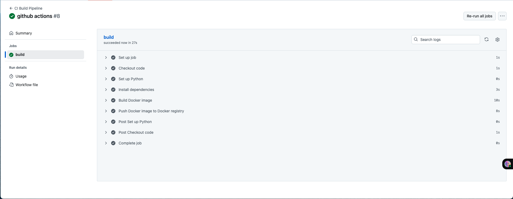

# Getting Started with Warp Build

## Project Structure
```
flask-app/
├── .github/workflows/
│   └── build.yml
├── app.py
├── requirements.txt
├── Dockerfile
└── README.md
```

## What is WarpBuild and how it speeds up your build process?

WarpBuild is a high performance CI platform that makes your build faster, more secure and easier to scale. Instead of running jobs on slow, shared runners, WarpBuild uses ephemeral VMs- fresh machines spuns up on each build, so you always get a clean isolated environment.

It speeds up builds through:
- Disk Snapshot - reuse state from previous builds for upto 10x faster setup
- Container Layer Caching - skip rebuilding unchanged layers
- Unlimited Concurrency - run as many job in parallel as your workflow need.

**Performance Benefits**:

- 30-50% faster builds on average
- 10x cheaper than traditional alternatives
- No queue waiting - instant job starts
- Better resource allocation - dedicated compute per job
- High-Performance Hardware - faster CPUs and NVMe SSDs
- Blazing Fast Cache - unlimited cache storage with faster I/O


## Prerequisites

- Github Account and Repository
- Admin access to your Github Organization(to modify workflows)
Basic GitHub Actions Knowledge – familiarity with `.github/workflows/` files.
- [WarpBuild Account](https://docs.warpbuild.com/ci/what-is-warpbuild)(free tier available)


> ⚠️ WarpBuild runners must be installed at the **organization level**. Personal repositories will **not** work.

## Step 1: Create a WarpBuild Account
- Sign up for a WarpBuild account at [https://app.warpbuild.com/](https://app.warpbuild.com/).  
- After signing up, you’ll be redirected to the GitHub bot installation. Grant **WarpBuild** access to the repositories where you want to use runners.  


### Alternative Setup  

- Enable WarpBuild runners at the **organization level** (personal repositories are not supported) by navigating to **Product > Runners > Enable Runners**.  


- You’ll then be redirected to grant access to the **WarpBuild Bot** — select the Organization where you want to install it.  


- Finally, grant **WarpBuild** access to the repositories where you want to use runners.  


# Step 2: Clone the Repo and Set Up the Environment

Let's now configure the WarpBuild runner for our repository, clone it locally, and set up a Python virtual environment.

```bash
# Clone the repository
git clone https://github.com/KrishikaWarpTest/Warp-build-runner-Sample.git
cd Warp-build-runner-Sample

# Create a virtual environment (macOS/Linux)
python3 -m venv venv

# Activate the virtual environment
# macOS/Linux
source venv/bin/activate
# Windows
# .\venv\Scripts\activate

# Upgrade pip
python -m pip install --upgrade pip

# Install dependencies
pip install -r requirements.txt
```

## Step 3: Add GitHub Actions Workflow for WarpBuild

We will now set up a CI workflow to build and push a Docker image using **WarpBuild runners**.  

### Key Changes for WarpBuild
- **Runner:** `warp-ubuntu-latest-x64-2x` instead of the standard GitHub runner (`ubuntu-latest`).  
- **Ephemeral environment:** Each job runs in a fresh VM with caching enabled automatically.  
- Everything else (checkout, Python setup, install dependencies, Docker build/push) remains the same.  

### Workflow Example

```yaml
name: CI Build Pipeline

on:
  push:
    branches:
      - main

jobs:
  build:
    runs-on: warp-ubuntu-latest-x64-2x

    steps:
      - name: Checkout code
        uses: actions/checkout@v2

      - name: Set up Python
        uses: actions/setup-python@v2
        with:
          python-version: '3.11'

      - name: Install dependencies
        run: |
          python -m pip install --upgrade pip
          pip install -r requirements.txt

      - name: Build Docker image
        run: docker build -t my-app .

      - name: Push Docker image
        env:
          DOCKER_USERNAME: ${{ secrets.DOCKER_USERNAME }}
          DOCKER_PASSWORD: ${{ secrets.DOCKER_PASSWORD }}
        run: |
          echo $DOCKER_PASSWORD | docker login -u $DOCKER_USERNAME --password-stdin
          docker tag my-app <dockerhub-username>/<repository-name>:latest
          docker push <dockerhub-username>/<repository-name>:latest
```
> ⚠️ Make sure the Docker Hub repository exists, and the secret values DOCKER_USERNAME and DOCKER_PASSWORD are set correctly in your GitHub repo secrets. Use a Docker Hub Access Token instead of your password for security. Replace `<dockerhub-username>` and `<repository-name>` with your actual Docker Hub username and repository name.

### GitHub Actions vs WarpBuild Runner Comparison

| Feature | Standard GitHub Actions | WarpBuild Runner |
|---------|------------------------|------------------|
| **Runner** | `ubuntu-latest` | `warp-ubuntu-latest-x64-2x` |
| **Environment** | Shared persistent runners | Ephemeral isolated VMs |
| **Caching** | Manual caching | Snapshots + container layer caching |
| **Concurrency** | Limited by GitHub plan | Unlimited parallel jobs |
| **Performance** | Standard | 30–50% faster builds on average |
| **Cost** | GitHub billing | 10x cheaper due to efficient resource usage |

Explore more features: https://docs.warpbuild.com/ci/features

## Step 4: Run your workflow

Once your GitHub Actions workflow is configured, you can run it to see WarpBuild in action.

Multiple runner configurations are available for different use cases. You can find more details about the runner configurations [here](https://docs.warpbuild.com/ci/what-is-warpbuild#supported-runners).

[](./static/4.png)

### Triggering the Workflow

- Push any changes to the `main` branch of your repository.  
- The workflow will automatically start on the **WarpBuild runner** you selected (`warp-ubuntu-latest-x64-2x`).  

### Build Time Comparison: GitHub Actions vs WarpBuild

| Workflow | Runner | Avg Build Time | Notes | Visual Representation |
|----------|--------|----------------|-------|-------|
| Standard GitHub Actions | `ubuntu-latest` | 27 seconds | Shared runner, manual caching, limited concurrency |  |
| WarpBuild Runner | `warp-ubuntu-latest-x64-2x` |  | Ephemeral VM, snapshots + container layer caching, unlimited concurrency |

> 💡 Tip: Use higher capacity runners (`4x`) for very large repositories or workflows that require more compute.  

## Conclusion

WarpBuild provides a high-performance, scalable, and cost-effective CI solution that dramatically speeds up your build and deployment process. By leveraging ephemeral VMs, snapshots, container layer caching, and unlimited concurrency, you can reduce build times, avoid queues, and ensure consistent, isolated environments for your workflows.  

This guide walks you through setting up WarpBuild runners at the organization level, configuring a CI workflow for a simple Flask app, and observing the benefits of caching and faster builds. Once fully configured, you can focus on shipping code faster, while WarpBuild handles the heavy lifting of build infrastructure.
